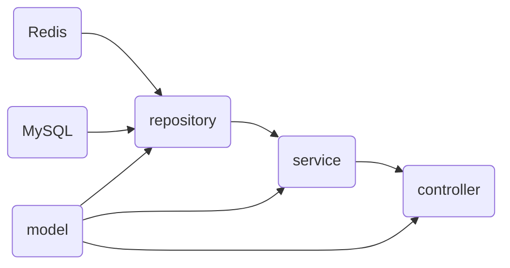
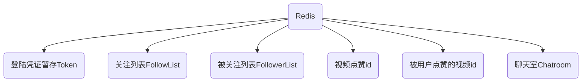
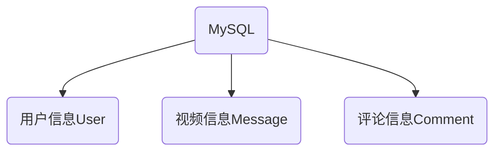
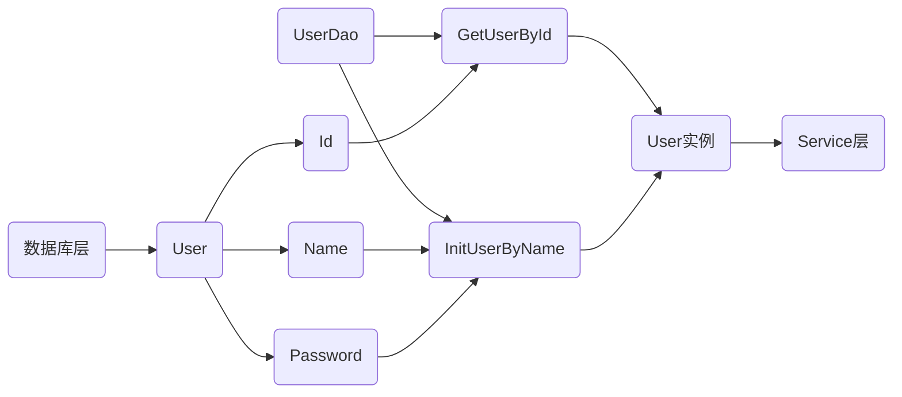
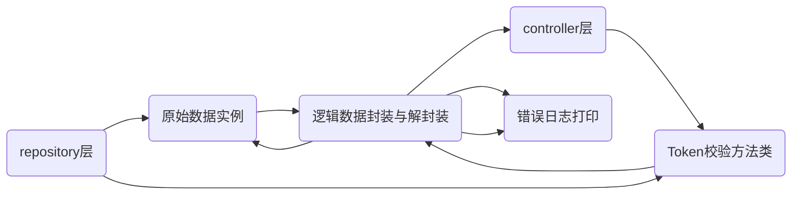

# Vshare短视频APP后端项目


***By Iscolito***

> 项目前端及其接口定义：[后端接口文档](https://bytedance.feishu.cn/docs/doccnKrCsU5Iac6eftnFBdsXTof)	[前端设计文档](https://bytedance.feishu.cn/docs/doccnM9KkBAdyDhg8qaeGlIz7S7)

本项目基于**Redis+MySQL**两个数据库及**Gorm+Hertz**两个框架进行开发，包括用户系统、视频系统和聊天系统三个模块，支持分布式部署。

## 1.项目整体框架

```shell
.
└── Vshare
    ├── config
    │   └── config.go
    ├── config.json
    ├── config_default.json
    ├── controller
    │   ├── comment.go
    │   ├── favorite.go
    │   ├── feed.go
    │   ├── message.go
    │   ├── publish.go
    │   ├── relation.go
    │   └── user.go
    ├── go.mod
    ├── go.sum
    ├── initdb.sql
    ├── main.go
    ├── model
    │   └── common.go
    ├── public
    │   ├── static
    │   │   └── vshare.png
    │   ├── test.mp4
    │   └── vshare.png
    ├── repository
    │   ├── comment.go
    │   ├── db_init.go
    │   ├── favorite.go
    │   ├── message.go
    │   ├── relation.go
    │   ├── token.go
    │   ├── user.go
    │   └── video.go
    ├── router.go
    ├── server.go
    ├── service
    │   ├── chat.go
    │   ├── comment.go
    │   ├── favorite.go
    │   ├── message.go
    │   ├── relation.go
    │   ├── streams.go
    │   ├── token.go
    │   └── user.go
    ├── test
    │   ├── test_comment.go
    │   ├── test_favorite.go
    │   ├── test_friend.go
    │   ├── test_gorm.go
    │   ├── test_message.go
    │   ├── test_redis.go
    │   ├── test_regist.go
    │   ├── test_relation.go
    │   ├── test_stream.go
    │   ├── test_user.go
    │   └── test_videolist.go
    └── util
        ├── logger.go
        └── time.go
```

### 项目分层

项目整体可以按层划分为以下四层：



用户数据持久化在数据层，主要由Redis数据库和MySQL数据库进行存储

#### 数据库层





其中Redis主要缓存具有时间戳的数据如Token,以及具有多对多的映射关系的数据类型，如关注、点赞等，聊天室使用Redis可以添加时间戳定期清理聊天内容。

#### Repository层

数据链路层使用Gorm框架作为ORM工具来读取MySQL的数据，使用go-redis项目作为读取Redis数据库的工具

> 两个库的Github链接：[Gorm](https://github.com/go-gorm/gorm)	[Go-redis](https://github.com/redis/go-redis)

Repository层通过为model层中的结构体添加go-tag的方式进行对象关系映射，并且使用该结构体作为向Service层传参的工具。

以User类为例：



#### Service层

服务层主要实现业务逻辑并且构建传递给前端的模型，内容与业务逻辑特点相关，主要抽象逻辑如下



其中主要完成的业务逻辑有：

-  推流算法
- 视频上传的链接拼接
- 好友关系推定
- 视频信息封装
- 聊天消息增加信息头


#### Contorller层

Controller层完成的工作主要是接受前端的传参并向前端传参，使用Http协议传输除去视频流外的全部请求，视频的上传和在线观看使用TCP协议进行传输。

Web框架上使用字节跳动开发的开源框架Hertz，链接为：[Hertz](https://github.com/cloudwego/hertz)

相应的路由已经在router.go文件中注册如下：

```go
func initRouters(h *server.Hertz) {
	h.Static("/static", "./public")

	apiRouter := h.Group("/douyin")

	h.GET("/stream/:name", controller.VideoFile)

	// basic apis
	apiRouter.GET("/feed/", controller.Feed)
	apiRouter.GET("/user/", controller.UserInfo)
	apiRouter.POST("/user/register/", controller.Register)
	apiRouter.POST("/user/login/", controller.Login)
	apiRouter.POST("/publish/action/", controller.Publish)
	apiRouter.GET("/publish/list/", controller.PublishList)

	// extra apis - I
	apiRouter.POST("/favorite/action/", controller.FavoriteAction)
	apiRouter.GET("/favorite/list/", controller.FavoriteList)
	apiRouter.POST("/comment/action/", controller.CommentAction)
	apiRouter.GET("/comment/list/", controller.CommentList)

	// extra apis - II
	apiRouter.POST("/relation/action/", controller.RelationAction)
	apiRouter.GET("/relation/follow/list/", controller.FollowList)
	apiRouter.GET("/relation/follower/list/", controller.FollowerList)
	apiRouter.GET("/relation/friend/list/", controller.FriendList)
	apiRouter.GET("/message/chat/", controller.MessageChat)
	apiRouter.POST("/message/action/", controller.MessageAction)
}
```


